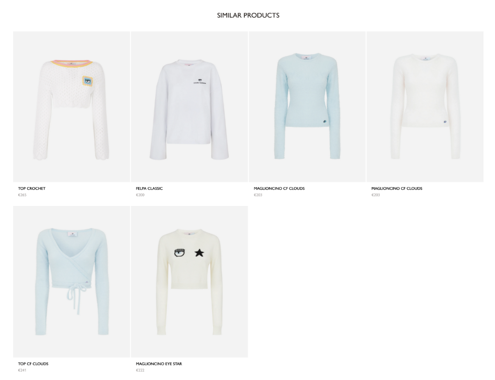

# IMAGE SIMILARITY ENGINE AND RECOMMENDER 🎨 👗 👛


### Project functionalities

 
🐝 CRUDS to handles images transformation in embedding vectors (ResNet, VGG-16 , InceptionV3, Xception
EfficientNet,BiT)

⌛ Search similar images to a given images in input

▓ Create a recommender system based on sales data per user

👚 Recommend items to a given users based on image similarity and collaborative filtering

### Custom extensions in loko

**⁂ CRUD collections:** 

The block allows to create, delete, retrieve and update a collection of images.

**⁂ Images Search:**

Once a collection of image is created, it requires an image as input and find similar images in a specific collection. 


**⁂ Recommender**

This block links sales data to a specific collection of images. So it accepts a csv file in input to create a recommender
system based on sales data. It provides a list of users and a list of suggested item for each specified user. Sales records about
a specific collection can be deleted.


Column names in the csv to be accepted by the system:

⚘ **md5email** - user ID 

⚘ **sku** - item ID

⚘ **order_id** - order ID

⚘ **zip** - ZIP code 

⚘ **country**

⚘ **created_at** order date and time

### Other aspects of the system:
The system supports a cache with results for users for whom a list of
suggestions, calculated by the system. This allows you to quickly get results and be able to train
a recommendation system whenever data is available. In our case the
system is not incremental because the per-user evaluation depends on both new sales data and
of the new ones, if the name of the collection is in common.
The referral system recalculates cache hints every time there is a data update
sales of a specific collection.


## Setup

1) Clone https://gitlab.livetech.site/livetech/recommender
2) Switch to branch `development`
3) `CD` into the project root (`recommender/`)
4) Create and activate venv (_requires python 3.9_):
```shell
virtualenv -p `which python3.9` venv && source venv/bin/activate
```
5) Install requirements using `pip`:
```shell
pip install requirements.txt
```

## Running

1) Run the server using docker e.g.:
```shell
docker-compose pull && \
docker-compose build && \
docker-compose down --remove-orphans && \
docker-compose up
```
2) Go to http://0.0.0.0/docs to check the swagger _(if you are on Windows go to http://localhost/docs)

## Integrated Results  





